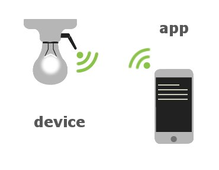
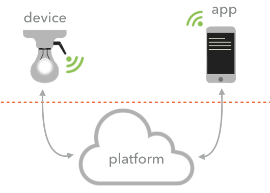
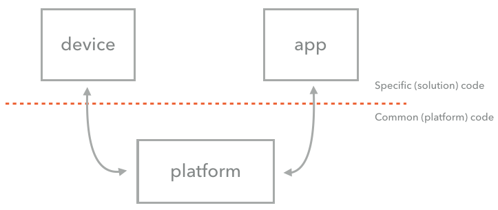
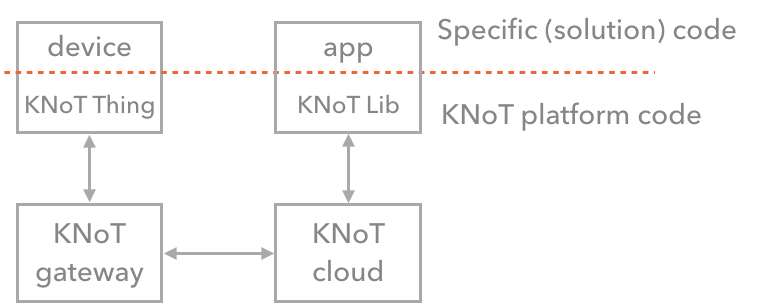

# Building IoT Solutions

An IoT solution, from the perspective of the user, is composed by a device and a controlling app, according to the image below.

However, from the developer's perspective, an IoT solution needs to connect a device to the Internet, send data to a server, store that data, and make it available so that an application can generate value from it. According to that, it is possible to realize that there are several operations of an IoT solution that are generic, and applicable to any solution in fact. To encapsulate these operations, we use "development platforms". These platforms group the generic operations required for a given problem class.

By using a platform, the developer can focus his efforts on what really matters, which are the specific code of his solution, leaving all the effort with connectivity, protocols, transmission and data storage in charge of the platform.

The KNoT platform, built based on IoT Architecture 1.0 explained above, also implements a multi-radio gateway, that is responsible for abstracting the way that the devices connect to the internet, serving as a proxy between the simple and cheap radios and the internet protocol (IP).

According to the image above, the KNoT platform implements 4 modules for deploying an IoT solution:
* KNoT Thing:Represents a device and is composed by hardware (microcontroller, power and RF Radio) and a software stack that handles the sensors, actuators and manages the incoming and outgoing messages exchanged with the gateway.

* KNoT Gateway:Acts as a proxy by connecting multiple devices with different wireless stacks to the internet, translate device's messages to a common protocol and send the data to the cloud. It also has a small instance of the cloud that is called fog, for local storage and processing.

* KNoT Cloud:It is a server that provides an API for data/message exchange between devices and apps. It also stores the device's data and performs temporal operations on it.

* KNoT Libs:Libraries for Android, iOS and Javascript that abstract the cloud and help the application development.
