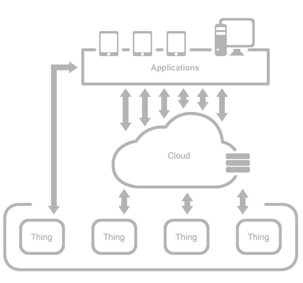

# Introduction to IoT Platforms

An IoT platform can be defined as a set of software and/or hardware that abstracts the key operations of an IoT solution. This means that a platform is expected to provide the means to collect device data, send it via internet to a server in the cloud, store, process, present, and manage such data in a way that provides useful information to the users. KNoT is called a meta-platform because it was built by using other open source platforms, to address interoperability. The main objective is to connect all existing IoT platforms, acting as a glue, and enabling them to talk to each other. According to the processing power and communication capabilities, an IoT platform can behave as one of the three architectures explained below.

## 1. Architecture 1.0 - Hub and Spoke

This architecture considers devices with low processing power and no IP. So, those devices have not enough processing capabilities to make decisions or run complex algorithms. For this reason, they must rely on other architectural elements like cloud services, for storage or data analysis. Usually, they are low cost devices with very limited microcontrollers to make the product economically viable. For instance, smart lights. The device generally uses a cheap radio to connect to a gateway, that forwards its data to the cloud.

## 1. Architecture 2.0 - Front Loaded

This architecture considers devices with low processing power, but with enough connectivity capabilities to have an IP Stack. For this reason, they do not need to rely on other architectural elements like gateways, for protocol translation nor internet connectivity. In this scenario, the devices can directly communicate with the applications or cloud services.

## 1. Architecture 3.0 - Smart Objects

This architecture considers devices with high processing power and also connectivity capabilities to have an IP Stack. For this reason, they can run complex algorithms (e.g. artificial intelligence), get data from other devices directly and make decisions autonomously. They also can directly coordinate other devices. Usually, they are high cost devices in the first place. Thus, embedding a powerful microcontroller is economically viable since its cost can be diluted on the product cost.

